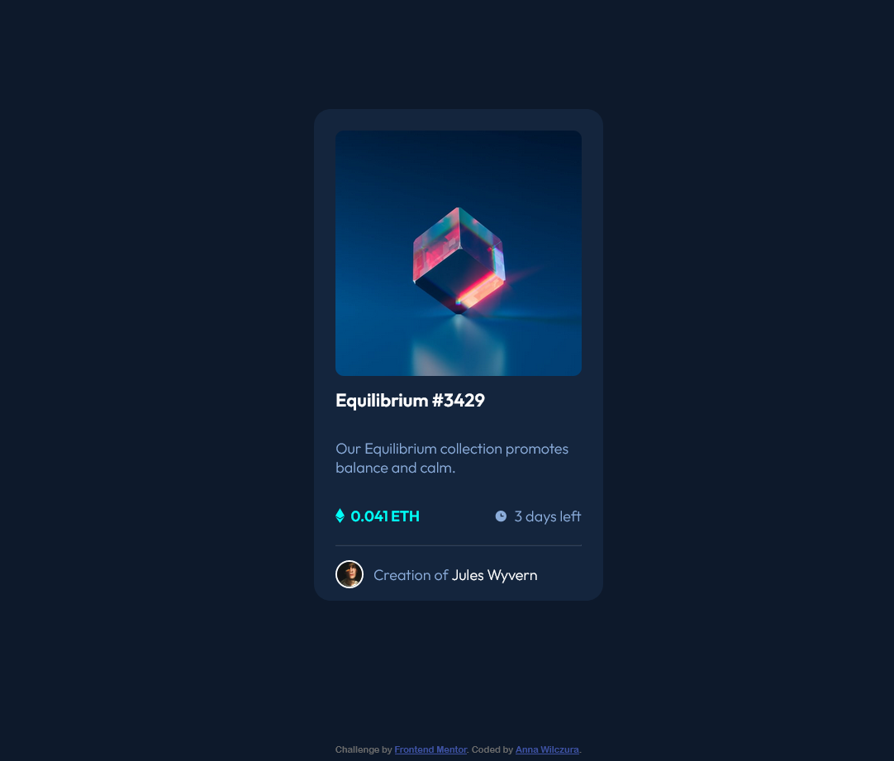

# Frontend Mentor - NFT preview card component solution

This is a solution to the [NFT preview card component challenge on Frontend Mentor](https://www.frontendmentor.io/challenges/nft-preview-card-component-SbdUL_w0U). Frontend Mentor challenges help you improve your coding skills by building realistic projects. 

## Table of contents

- [Overview](#overview)
  - [The challenge](#the-challenge)
  - [Screenshot](#screenshot)
  - [Links](#links)
- [My process](#my-process)
  - [Built with](#built-with)
  - [What I learned](#what-i-learned)
  - [Continued development](#continued-development)
  - [Useful resources](#useful-resources)
- [Author](#author)

**Note: Delete this note and update the table of contents based on what sections you keep.**

## Overview

### The challenge

Users should be able to:

- View the optimal layout depending on their device's screen size
- See hover states for interactive elements

### Screenshot

### Links

- Solution URL: [Add solution URL here](https://your-solution-url.com)
- Live Site URL: [Add live site URL here](https://your-live-site-url.com)

## My process

### Built with

- Semantic HTML5 markup
- CSS
- Flexbox

### What I learned

I learned about pseudoclasses and tested clamp() function, which helped me to make the element responsive for smaller screen sizes - I tried to keep proportions of some elements similar for every size.

### Continued development

I need to practice more usage of pseudoclasses and hover effects, because some behaviours of CSS code I tried to use were sometimes unexpected :)

I'm going to learn about CSS variables and Sass and I'll try to use it in my next projects.

### Useful resources

- [https://www.youtube.com/watch?v=U9VF-4euyRo](https://www.youtube.com/watch?v=U9VF-4euyRo) - Very nice tutorial about min(), max() and clamp() funtions

## Author

- Frontend Mentor - [@Anq92](https://www.frontendmentor.io/profile/Anq92)
